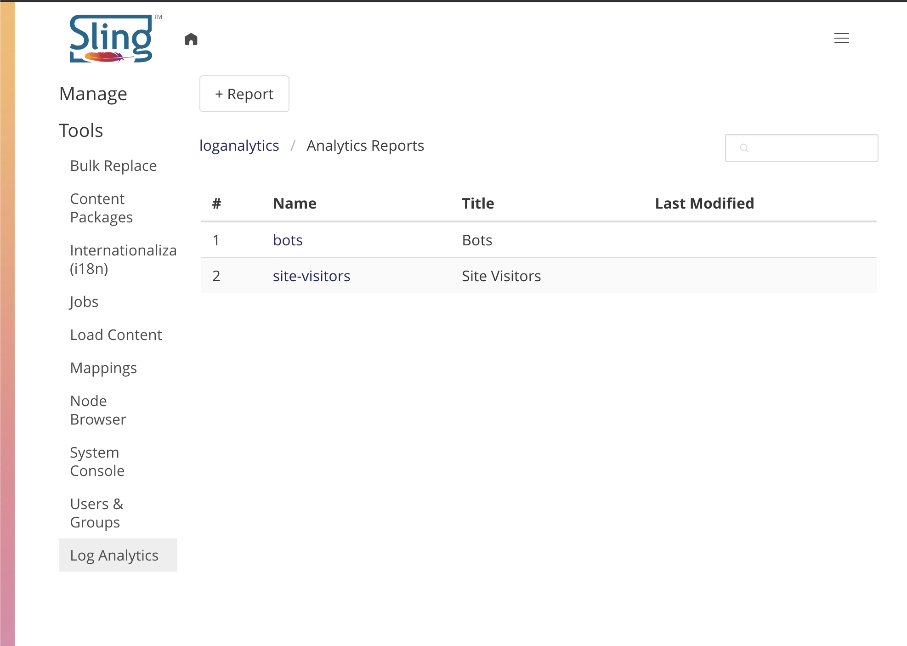

<!--
 * Copyright (C) 2020 Dan Klco
 *
 * Licensed under the Apache License, Version 2.0 (the "License");
 * you may not use this file except in compliance with the License.
 * You may obtain a copy of the License at
 *
 *      http://www.apache.org/licenses/LICENSE-2.0
 *
 * Unless required by applicable law or agreed to in writing, software
 * distributed under the License is distributed on an "AS IS" BASIS,
 * WITHOUT WARRANTIES OR CONDITIONS OF ANY KIND, either express or implied.
 * See the License for the specific language governing permissions and
 * limitations under the License.
 -->

# Apache Sling CMS- Log Analytics Plugin

A plugin to enable basic analytics via log reading in the
[Apache Sling CMS](https://github.com/apache/org-apache-sling-app-cms).

## Installation

Download the [build the code](#building) or latest release and install it into an
Apache Sling CMS instance via the OSGi console at {sling_cms_host}/system/console/bundles.

A new log will be created for this, fullrequest.log, which will be used for analysis.

## Use

Reports can be found at Tools > Log Analytics. To view a report, click on the report name. To edit the report click the pencil.

### Filters

Each report has a global filter, which can be pre-populated based on [Filtrex expressions](https://github.com/joewalnes/filtrex) against the following variables:

- time
- responseTime
- responseSize
- status
- refererPath
- refererHost
- language
- method
- path
- protocol
- host
- userAgent
- contentType
- user
- sessionId
- referer
- platform
- remoteHost
- queryString
- postalCode
- regionCode
- countryCode
- forwardedFor
- browser
- browserType
- browserMajorVersion
- deviceType
- platformVersion
- resolvedPath
- resolvedIp

To filter the requests for the report, for example:

	{
	"time": 1594422239000,
	"responseTime": 2,
	"responseSize": 0,
	"status": 200,
	"refererPath": "",
	"refererHost": "",
	"language": "en-US",
	"method": "GET",
	"path": "/static/clientlibs/sling-cms/js/wysihtml.toolbar.min.map",
	"protocol": "HTTP/1.1",
	"host": "localhost:8080",
	"userAgent": "Mozilla/5.0 (Macintosh; Intel Mac OS X 10_14_6) AppleWebKit/537.36 (KHTML, like Gecko) Chrome/83.0.4103.116 Safari/537.36",
	"contentType": "application/json;charset=UTF-8",
	"user": "admin",
	"sessionId": "node0rs0lrzicp3901q4ov5v3cst8y0.node0",
	"referer": "-",
	"platform": "macOS",
	"remoteHost": "0:0:0:0:0:0:0:1",
	"queryString": "",
	"postalCode": "",
	"regionCode": "",
	"countryCode": "",
	"forwardedFor": "-",
	"browser": "Chrome",
	"browserType": "Browser",
	"browserMajorVersion": "83",
	"deviceType": "Desktop",
	"platformVersion": "10.14",
	"resolvedPath": "/static/clientlibs/sling-cms/js/wysihtml.toolbar.min.map",
	"resolvedIp": "0:0:0:0:0:0:0:1"
	}

Each report item also has a filter which can be set to limit the requests for that report. All filters can be defaulted in the edit mode and overriden / changed when viewing the report.

### Report Visualizations

There are four report visualizations which can be added and configured in the report:

#### Timeseries

Displays requests over time.

#### Grouped Table

Shows the number of requests per a value of one or more fields.

#### Pie Chart

Shows the percentage of requests per a value of one or more fields.

#### Bar Chart

Shows the percentage of requests per a value of one or more fields.

## Building

This project requires Apache Maven 3 and Java JDK8. To build the project run:

`mvn clean install`

To install the bundle into a local Sling CMS instance running on port 8080, run:

`mvn clean install -P autoInstallBundle`
